

  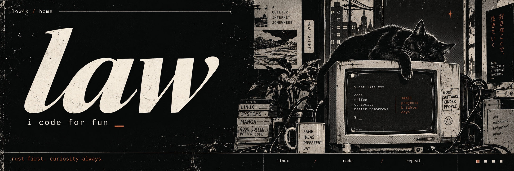

  <a href="https://discord.gg/shizuku">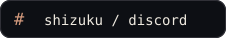</a>
  &nbsp;
  <a href="https://www.tiktok.com/@manhwamc">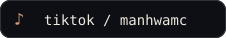</a>
  &nbsp;
  <a href="https://github.com/low4k?tab=repositories">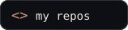</a>

law here · i code for fun · rust is my favorite · discord: <b>manhwamc</b>

 

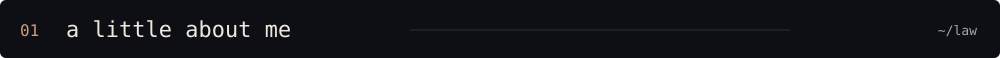

<table>
<tr>
<td width="63%" valign="top">


i like making things and figuring out how they work

sometimes that means a game, sometimes a bot, sometimes a whole language toolchain

most of it lives on my pc. a few things end up here

</td>
<td width="37%" align="center" valign="middle">
<a href="https://www.pinterest.com/pin/1082060248002849405/">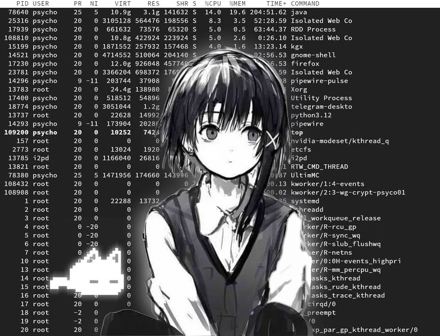</a>
 one more thing to try
</td>
</tr>
</table>

 

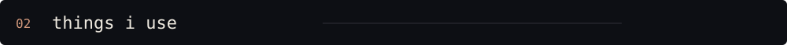

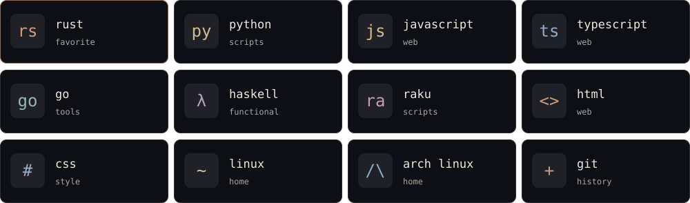

rust gets first pick. the rest depends on what i'm making

more of the stack

| where | what i use |
| :--- | :--- |
| games and visuals | three.js · webgl · canvas · web audio · anime.js |
| web and bots | node.js · express · browser automation · discord bots |
| data | sqlite · postgres · redis |
| tools | cargo · docker · git · bash · powershell |
| other things i've worked with | c# · .net · winforms · adobe scripts |

 

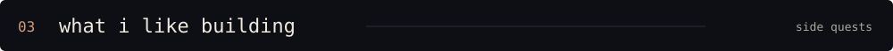

<table>
<tr>
<td width="50%">
<h3>01 &nbsp; language tools</h3>
parsers, interpreters, vms, and the tools around them
  rust / language design
</td>
<td width="50%">
<h3>02 &nbsp; games</h3>
browser games, combat systems, and little things to play with
  three.js / webgl / canvas
</td>
</tr>
<tr>
<td>
<h3>03 &nbsp; bots and scripts</h3>
discord bots, scrapers, and tools that save a few clicks
  python / raku / js / rust
</td>
<td>
<h3>04 &nbsp; browser stuff</h3>
web apps, browser tools, and native browser experiments
  js / rust / html / css
</td>
</tr>
<tr>
<td>
<h3>05 &nbsp; motion and art</h3>
animation, audio, and scripts for visual work
  anime.js / web audio / adobe scripts
</td>
<td>
<h3>06 &nbsp; terminal things</h3>
small tools that make the terminal a little more fun
  linux / arch / cli tools
</td>
</tr>
</table>

 

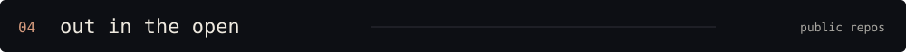

<a href="https://github.com/low4k/zzz">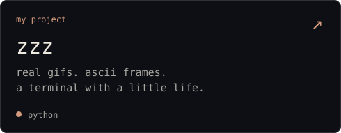</a>
<a href="https://github.com/low4k/tako-code">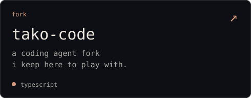</a>

 

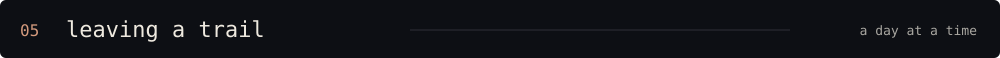

<picture>
  <source media="(prefers-color-scheme: dark)" srcset="assets/snake-dark.svg" />
  <source media="(prefers-color-scheme: light)" srcset="assets/snake.svg" />
  
</picture>

a little trail of things i've done here

 

  
<b>probably making something</b>
 come hang out at <a href="https://discord.gg/shizuku">shizuku</a>

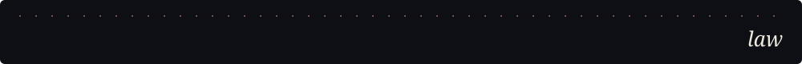

art and bits

the lain image and panda are from the pins i picked: [lain](https://www.pinterest.com/pin/1082060248002849405/) · [panda](https://www.pinterest.com/pin/370772981800705995/)

banner made for this profile with imagegen. the contribution snake uses [snk](https://github.com/Platane/snk)

